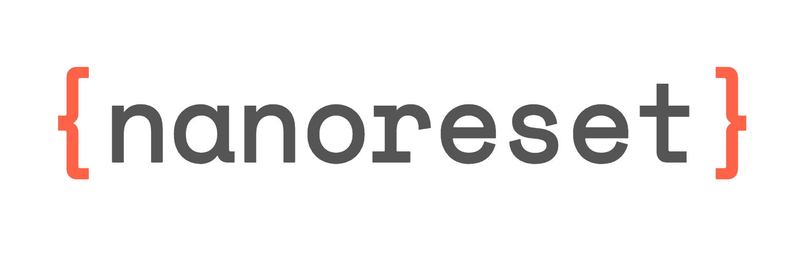

<div align="center">
	
	<br>
  <strong>Simple CSS reset(839 B bytes)</strong>
</div>
<br>
<div align="center">
  <a href="https://npmjs.org/package/nanoreset">
    
  </a>
  <a href="https://npmjs.org/package/nanoreset">
  
  </a>
  <a href="https://github.com/feross/standard">
    
  </a>
  <a href="https://travis-ci.org/tiaanduplessis/nanoreset">
    
  </a>
  <a href="https://github.com/tiaanduplessis/nanoreset/blob/master/LICENSE">
    
  </a>
  <a href="http://makeapullrequest.com">
    
  </a>
  <a href="https://www.paypal.me/tiaanduplessis/1">
    
  </a>
</div>
<br>
<div align="center">
  <a href="https://github.com/tiaanduplessis/nanoreset/watchers">
    
  </a>
  <a href="https://github.com/tiaanduplessis/nanoreset/stargazers">
    
  </a>
  <a href="https://twitter.com/intent/tweet?text=Check%20out%20nanoreset!%20https://github.com/tiaanduplessis/nanoreset%20%F0%9F%91%8D">
    
  </a>
</div>
<br>
<div align="center">
  Built with ❤︎ by <a href="tiaan.beer">Tiaan</a> and <a href="https://github.com/tiaanduplessis/nanoreset/graphs/contributors">contributors</a>
</div>

<h2>Table of Contents</h2>
<details>
  <summary>Table of Contents</summary>
	<li><a href="#about">About</a></li>
  <li><a href="#install">Install</a></li>
  <li><a href="#demo">Demo</a></li>
	<li><a href="#others">Others</a></li>
  <li><a href="#contribute">Contribute</a></li>
  <li><a href="#license">License</a></li>
</details>

## About

[](https://greenkeeper.io/)

[Nanoreset](https://github.com/tiaanduplessis/nanoreset) is an simple CSS reset intented to be lightweight while still providing an a solid base for your project. It differs from [other similar projects](#others) in that it is subjective to my use cases and preferences.

## Install

With package manager:

```sh

$ npm install --save nanoreset
# OR
$ yarn add nanoreset

```

With CDN:

```html

<link rel="stylesheet" href="https://cdn.rawgit.com/tiaanduplessis/nanoreset/master/nanoreset.min.css">
<!-- Or -->
<link rel="stylesheet" href="https://unpkg.com/nanoreset/nanoreset.min.css">

```

## Demo

Checkout [the demo](https://tiaanduplessis.github.io/nanoreset/) using [HTML5 Test Page](https://github.com/cbracco/html5-test-page).

## Others

Some other great options:

- [normalize.css](https://necolas.github.io/normalize.css/)
- [sanitize.css](https://jonathantneal.github.io/sanitize.css/)
- [minireset.css](https://github.com/jgthms/minireset.css)

## Contribute

Contributions are welcome. Please open up an issue or create PR if you would like to help out.

Note: If editing the README, please conform to the [standard-readme](https://github.com/RichardLitt/standard-readme) specification.

## License

Licensed under the MIT License.
