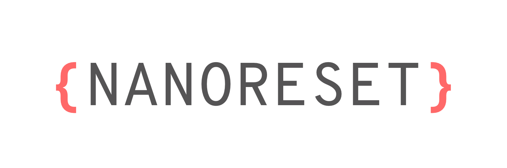

<div align="center">
	
	<br>
  <strong>Groovy CSS reset in less than a kilobyte</strong>
</div>
<br>
<div align="center">
  <a href="https://npmjs.org/package/nanoreset">
    
  </a>
  <a href="https://npmjs.org/package/nanoreset">
  
  </a>
  <a href="https://github.com/feross/standard">
    
  </a>
  <a href="https://travis-ci.org/tiaanduplessis/nanoreset">
    
  </a>
  <a href="https://github.com/tiaanduplessis/nanoreset/blob/master/LICENSE">
    
  </a>
  <a href="http://makeapullrequest.com">
    
  </a>
<a href="https://greenkeeper.io/">
    
  </a>
</div>
<br>

## Table of Contents

- [Table of Contents](#table-of-contents)
- [About](#about)
- [Install](#install)
- [Demo](#demo)
- [Others](#others)
- [Contribute](#contribute)
- [License](#license)

## About

[Nanoreset](https://github.com/tiaanduplessis/nanoreset) is an simple CSS reset intented to be lightweight while still providing an a solid base for your project. It differs from [other similar projects](#others) in that it is subjective to my use cases and preferences.

## Install

With package manager:

```sh

$ npm install --save nanoreset
# OR
$ yarn add nanoreset

```

With CDN:

In your html

```html
<link rel="stylesheet" href="https://unpkg.com/nanoreset/nanoreset.min.css">
```

or directly in your css

```css
@import url('https://unpkg.com/nanoreset/nanoreset.min.css')
```

## Demo

Checkout [the demo](https://tiaanduplessis.github.io/nanoreset/) using [HTML5 Test Page](https://github.com/cbracco/html5-test-page).

## Others

Some other options:

- [normalize.css](https://necolas.github.io/normalize.css/)
- [sanitize.css](https://jonathantneal.github.io/sanitize.css/)
- [minireset.css](https://github.com/jgthms/minireset.css)

## Contribute

Contributions are welcome. Please open up an issue or create PR if you would like to help out. If editing the README, please conform to the [standard-readme](https://github.com/RichardLitt/standard-readme) specification.

## License

Licensed under the MIT License.
