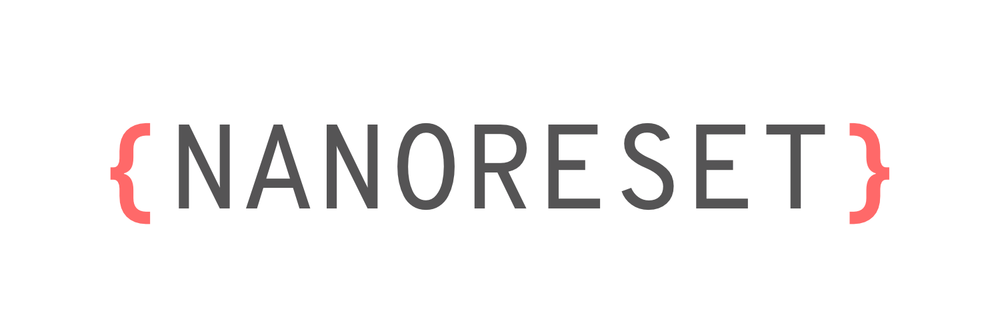

<div align="center">
	
	<br>
  <strong>Minimal CSS reset in less than 500 bytes</strong>
</div>
<br>

## Table of Contents

- [Table of Contents](#table-of-contents)
- [Background](#background)
- [Install](#install)
- [Demo](#demo)
- [Contribute](#contribute)
- [License](#license)

## Background

[Nanoreset](https://github.com/tiaanduplessis/nanoreset) is an minimal CSS reset intented for modern web apps. It is heavily based on [Josh's Custom CSS Reset](https://www.joshwcomeau.com/css/custom-css-reset/) with slight modifcations for my use cases.

## Install

With package manager:

```sh
npm install nanoreset
```

```sh
pnpm add nanoreset
```

```sh
yarn add nanoreset
```

With CDN:

In your HTML:

```html
<link rel="stylesheet" href="https://unpkg.com/nanoreset/nanoreset.min.css">
```

or directly in your CSS:

```css
@import url('https://unpkg.com/nanoreset/nanoreset.min.css')
```

## Demo

Checkout [the demo](https://tiaanduplessis.github.io/nanoreset/) using [HTML5 Test Page](https://github.com/cbracco/html5-test-page).

## Contribute

Contributions are welcome. Please open up an issue or create PR if you would like to help out. If editing the README, please conform to the [standard-readme](https://github.com/RichardLitt/standard-readme) specification.

## License

Licensed under the MIT License.
